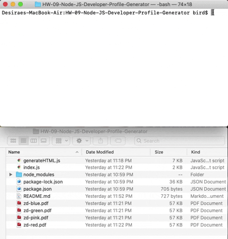

# Unit 09 Node.js and ES6+ Homework: Developer Profile Generator

This is a command-line application that dynamically generates a PDF profile from a GitHub username. The application will be invoked with the following command:

```sh
node index.js
```

The user will be prompted for a favorite color, which will be used as the background color for cards.

The PDF will be populated with the following:

* Profile image
* User name
* Links to the following:
  * User location via Google Maps
  * User GitHub profile
* User bio
* Number of public repositories
* Number of followers
* Number of GitHub stars
* Number of users following

GitHub Repository: https://github.com/zidandesirae/9-Node.jsAndES6-DeveloperProfileGenerator/


